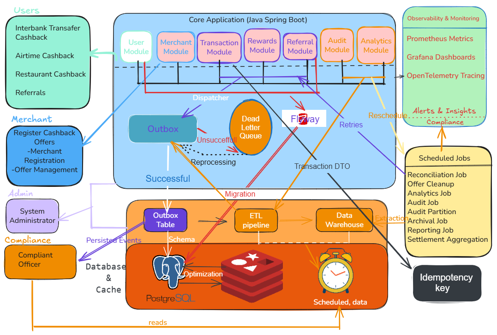
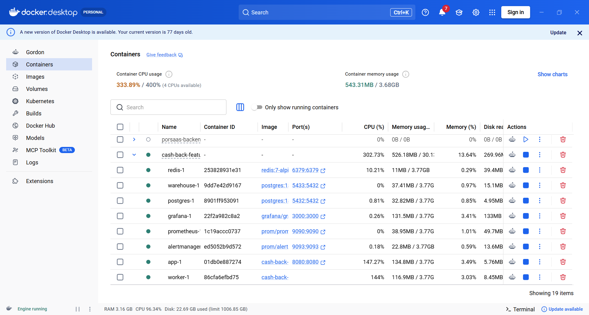

# Cashback Feature API

Spring Boot cashback API for users, merchants, transactions, rewards, referrals, audit events, and analytics.

PostgreSQL is the system of record. Redis provides cache and short-lived concurrency controls. Redshift Serverless stores analytics and archive data. The application is a modular monolith with a separate worker mode for asynchronous outbox dispatch.



## Contents

- [Features](#features)
- [Architecture](#architecture)
- [Requirements](#requirements)
- [Run locally](#run-locally)
- [Docker services](#docker-services)
- [API](#api)
- [Idempotency](#idempotency)
- [Outbox worker](#outbox-worker)
- [Observability](#observability)
- [Configuration](#configuration)
- [Database migrations](#database-migrations)
- [Tests](#tests)
- [Production checklist](#production-checklist)

## Features

- User registration and role based access for users, merchants, administrators, and compliance operators.
- Merchant registration and active cashback offers.
- Cashback calculation and validation by transaction type.
- PostgreSQL reward balances and referral bonus limits.
- Redis cache for balances, offers, referral views, and transaction concurrency markers.
- Client idempotency keys for transaction submission.
- Durable PostgreSQL outbox with retry, backoff, and dead letter handling.
- Daily reconciliation and Quartz jobs for audit, cleanup, reporting, settlement, and archival.
- Incremental warehouse ETL with a composite transaction watermark.
- Prometheus metrics and OpenTelemetry export.
- Docker Compose for the API, PostgreSQL, Redis, and a local warehouse substitute.

This project is an API foundation, not a complete payment processor. Payment authorization, settlement, refunds, chargebacks, identity verification, and a production accounting ledger are outside the current scope.

## Architecture

```text
Client
  -> Spring Boot API
  -> PostgreSQL transaction and reward update
  -> PostgreSQL outbox event in the same transaction
  -> Separate worker process
  -> Redis cache refresh or warehouse ETL
```

### Domain modules

| Module | Responsibility |
| --- | --- |
| user | Accounts, roles, passwords, referral codes, and balances |
| transaction | Intake, cashback rules, validation, idempotency, and analytics |
| merchant | Merchants, offers, expiry, and offer cache |
| rewards | Reward records, credits, balances, and analytics |
| referral | Referral registration, limits, and usage views |
| audit | Compliance events, anomaly records, and audit endpoints |
| analytics | Warehouse access, ETL, archive export, and queries |
| scheduler | Reconciliation, reporting, audit, cleanup, settlement, and archive jobs |
| observability | Metrics, Prometheus, and OpenTelemetry |

The modular monolith keeps database transactions local and makes development and testing simple. The tradeoff is a shared JVM, release cycle, and process boundary. The outbox worker profile separates asynchronous failures from API request handling.

## Requirements

- Java 25
- Docker Desktop with Compose
- Gradle Wrapper

PostgreSQL, Redis, the local warehouse substitute, the outbox worker, Prometheus, Alertmanager, and Grafana run through Docker Compose. Redshift is optional for local development because Compose provides a PostgreSQL warehouse substitute.

## Run locally

Set the required local passwords before starting Compose:

```powershell
$env:POSTGRES_PASSWORD = "local-postgres-password"
$env:WAREHOUSE_PASSWORD = "local-warehouse-password"
$env:GRAFANA_ADMIN_PASSWORD = "admin"
docker compose up -d --build
```

The first image build may retry Gradle and Maven downloads when Docker Hub or Maven Central has transient network failures. The Gradle wrapper uses a 120-second distribution download timeout.

The API runs at `http://localhost:8080`. Follow application logs with:

```powershell
docker compose logs -f app
```

Stop the environment with:

```powershell
docker compose down
```

### Fresh local database

PostgreSQL 18 uses major-version-specific data directories. The Compose file mounts the v18-compatible paths and uses dedicated `*-data-v18` volumes. If an older local volume is still present, stop the stack and remove only the old database volumes before restarting:

```powershell
docker compose down
docker volume ls | Select-String "cash-back-feature_(postgres-data|warehouse-data)$"
```

Only remove those old volumes if their data is disposable. The current Compose volumes are `postgres-data-v18` and `warehouse-data-v18`.

## Docker services

| Service | Purpose | Local address |
| --- | --- | --- |
| `app` | Spring Boot API | `http://localhost:8080` |
| `worker` | Dedicated asynchronous outbox dispatcher | Internal container |
| `postgres` | Application system of record | `localhost:5432` |
| `warehouse` | Local PostgreSQL warehouse substitute | `localhost:5433` |
| `redis` | Cache and concurrency controls | `localhost:6379` |
| `prometheus` | Metrics scraping and alert rules | `http://localhost:9090` |
| `alertmanager` | Prometheus alert routing | `http://localhost:9093` |
| `grafana` | Metrics dashboards | `http://localhost:3000` |

The worker is a separate container built from the same application image. It runs with the `worker` Spring profile and `CASHBACK_OUTBOX_WORKER_ENABLED=true`; the API container leaves the dispatcher disabled.



Stop the environment with:

```powershell
docker compose down
```

## API

The local API uses HTTP Basic authentication. Production should use OAuth2 or OIDC with short lived tokens.

### User registration

```text
POST /api/users/register
GET  /api/users/{email}
```

```json
{
  "email": "ada@example.com",
  "password": "replace-me",
  "fullName": "Ada Example",
  "referralCode": "ADA123"
}
```

Public registration always creates a `USER` account. Privileged roles require administrative provisioning.

### Merchants and offers

```text
POST /api/merchants/register
POST /api/merchants/{merchantId}/offers
GET  /api/merchants/{merchantId}/offers
GET  /api/merchants/offers/analytics
```

### Transactions

```text
POST /api/transactions
GET  /api/transactions/user/{userId}
GET  /api/transactions/analytics
```

Every transaction submission requires a unique idempotency key for that user:

```json
{
  "user": { "id": "22222222-2222-2222-2222-222222222222" },
  "merchant": { "id": "33333333-3333-3333-3333-333333333333" },
  "offer": { "id": "44444444-4444-4444-4444-444444444444" },
  "amount": 100.00,
  "type": "AIRTIME",
  "idempotencyKey": "checkout-20260903-0001"
}
```

### Rewards, referrals, and audit

```text
POST /api/rewards/credit?userId={userId}&amount=25.00&description=Promotion
GET  /api/rewards/user/{userId}
GET  /api/rewards/user/{userId}/balance
GET  /api/referrals/{referrerId}
POST /api/referrals?referralCode=ADA123&referredUserId={userId}&isUKReferral=false
GET  /api/audit/events
GET  /api/audit/events/{eventType}
GET  /api/audit/events/id/{id}
```

Audit endpoints require `ADMIN` or `COMPLIANCE` access.

### Health and metrics

```text
GET /actuator/health
GET /actuator/prometheus
```

## Idempotency

The transaction request key is persisted in PostgreSQL and protected by a unique constraint on `(user_id, idempotency_key)`.

- The same user and key return the original transaction.
- The same key with a different transaction payload is rejected.
- Different users may use the same key.
- Redis uses `cashbackEligibility:processed:{transactionId}` only as a short lived concurrency optimization.
- PostgreSQL remains the source of truth after Redis expiry or failure.

Clients should reuse the same key for every retry of one logical submission. Do not generate a new key for a network retry.

## Outbox worker

Business updates and outbox rows are written in the same PostgreSQL transaction. The API does not load the dispatcher by default.

Run the API without the worker:

```powershell
$env:SPRING_PROFILES_ACTIVE = ""
$env:CASHBACK_OUTBOX_WORKER_ENABLED = "false"
```

Run the dispatcher in a separate process:

```powershell
$env:SPRING_PROFILES_ACTIVE = "worker"
$env:CASHBACK_OUTBOX_WORKER_ENABLED = "true"
.\gradlew.bat bootRun
```

The dispatcher processes `PENDING`, `PROCESSING`, and `FAILED` events. It retries with bounded exponential backoff and moves events to `DEAD_LETTER` after the retry limit. Delivery is at least once, so Redis and warehouse handlers must be idempotent.

Check the worker directly with:

```powershell
docker compose logs -f worker
docker compose ps worker
```

## Observability

The Compose stack uses the existing files under `src/main/java/com/example/cashback/observability`:

- Prometheus scrapes `app:8080/actuator/prometheus` every 15 seconds.
- `alerts.yml` defines job and Quartz failure rules.
- Alertmanager receives Prometheus alerts on `alertmanager:9093`.
- Grafana is provisioned with Prometheus at `http://prometheus:9090`.
- Grafana is available at `http://localhost:3000` with the configured `GRAFANA_ADMIN_PASSWORD`.

The local Compose stack uses `alertmanager-local.yml`, which accepts alerts without requiring Slack or PagerDuty credentials. The production-oriented `alertmanager.yml` remains available for deployments that provide notification secrets.

Prometheus and Alertmanager configuration files are mounted directly from:

```text
src/main/java/com/example/cashback/observability/prometheus
```

Grafana provisioning and dashboards are stored under:

```text
src/main/java/com/example/cashback/observability/grafana
```

## Configuration

Required environment variables:

```text
DB_USERNAME=postgres
DB_PASSWORD=change-me
REDSHIFT_NAMESPACE_ARN=<namespace-identifier>
AWS_REGION=eu-north-1
REDSHIFT_JDBC_URL=jdbc:redshift:iam://<workgroup-endpoint>:5439/<database>
REDSHIFT_DB_USERNAME=<warehouse-user>
REDSHIFT_DB_PASSWORD=change-me
WAREHOUSE_DATASOURCE_DRIVER_CLASS_NAME=com.amazon.redshift.jdbc42.Driver
```

Redis defaults:

```text
SPRING_REDIS_HOST=localhost
SPRING_REDIS_PORT=6379
```

Business settings:

```text
cashback.transaction-eligibility-ttl=48h
cashback.referral-cache-ttl=30d
cashback.referral-local-max-bonus=8000
cashback.referral-uk-max-bonus=10000
cashback.outbox.worker-enabled=false
```

The transaction eligibility TTL must remain between 24 and 48 hours. Never commit passwords, tokens, access keys, or production connection strings.

## Database migrations

Flyway applies migrations from `src/main/resources/db/migration` at startup. The application PostgreSQL datasource is explicitly primary, so Flyway and JPA target `cash-back`; the separate warehouse datasource is used only by ETL and analytics services.

Add new migrations with a higher version number. A fresh database should contain `flyway_schema_history` after the API starts.

Important hardening migrations include:

- `V18`: outbox events
- `V19`: financial constraints
- `V20`: audit idempotency fingerprints
- `V22`: referral bonus counter
- `V23`: transaction idempotency key and unique constraint

`V2` creates a range-partitioned audit table. Its composite primary key includes `timestamp`, as required by PostgreSQL partitioned-table constraints.

The warehouse schema is currently created by ETL and archive services. Production should move warehouse DDL into a separately versioned migration process. The `prod` profile expects the official Quartz PostgreSQL schema to exist.

To inspect migration status locally:

```powershell
docker exec cash-back-feature-postgres-1 psql -U postgres -d cash-back -c "\dt"
docker exec cash-back-feature-postgres-1 psql -U postgres -d cash-back -c "SELECT installed_rank, version, description, success FROM flyway_schema_history ORDER BY installed_rank;"
```

## Tests

Run the full test suite:

```powershell
.\gradlew.bat test --no-daemon
```

Run transaction tests only:

```powershell
.\gradlew.bat test --tests "*TransactionServiceTest" --no-daemon
```

The test suite covers transaction validation, idempotency replay and conflicts, concurrent credit protection, outbox transaction boundaries, retry and dead letter behavior, and reconciliation reporting.

## Production checklist

Before production, configure and verify:

- TLS for clients, PostgreSQL, Redis, and Redshift.
- OAuth2 or OIDC instead of local HTTP Basic authentication.
- Managed identity or IAM authentication where supported.
- Managed secret storage, rotation, and access auditing.
- Encryption at rest and in transit, including backups.
- Minimal personal data in warehouse tables with masking rules.
- Immutable or restricted audit retention.
- Centralized access logs and alerting.
- Edge rate limiting and abuse detection.
- Independent reconciliation of debits, cashback credits, and merchant payouts.
- Restore, retention, deletion, incident response, and manual review procedures.

Application controls improve readiness but are not a compliance certification.

## Known scale limits

- ETL uses `(created_at, id)` watermarks. CDC is preferable at very high throughput.
- ETL currently performs per-row warehouse `MERGE` operations. Production should use staging tables and bulk loading.
- Outbox delivery is at least once and requires idempotent handlers.
